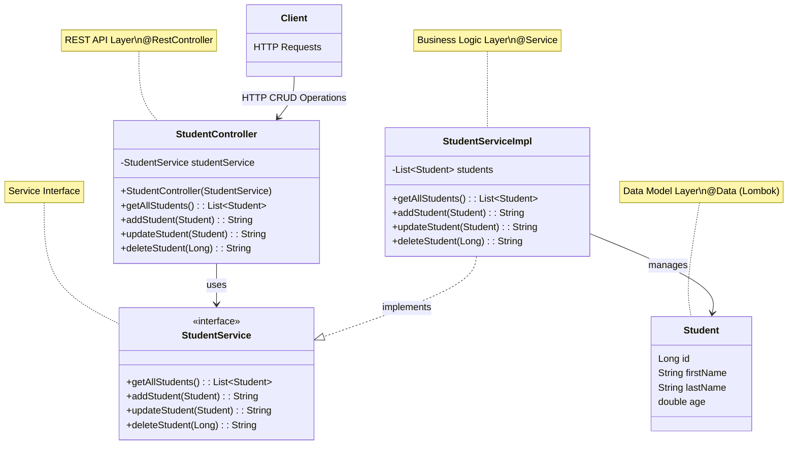
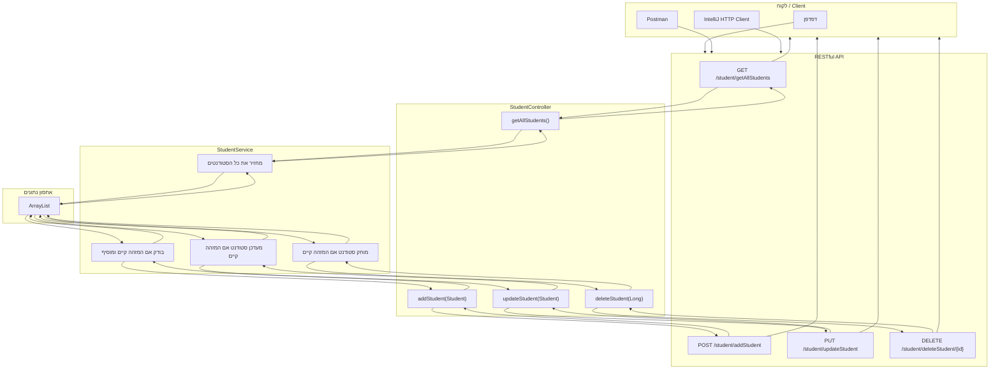

<div dir="rtl">

# מדריך מקיף לאפליקציית Spring Boot עם פעולות CRUD

## מבוא

אפליקציית Spring Boot זו מהווה מערכת מלאה לניהול סטודנטים, הכוללת את כל פעולות ה-CRUD (יצירה, קריאה, עדכון ומחיקה). המערכת מאורגנת בארכיטקטורת שכבות ברורה ומיישמת עקרונות פיתוח מודרניים.

### קצת על REST

REST (Representational State Transfer) הוא סגנון ארכיטקטוני המגדיר עקרונות לבניית שירותי אינטרנט. העקרונות המרכזיים כוללים:

1. **ארכיטקטורת לקוח-שרת** - הפרדה ברורה בין הלקוח והשרת
2. **חוסר מצב (Statelessness)** - כל בקשה מכילה את כל המידע הנדרש לביצועה
3. **יכולת קישוי (Cacheability)** - תשובות צריכות להגדיר האם ניתן לשמור אותן במטמון
4. **ממשק אחיד (Uniform Interface)** - שימוש בפעולות HTTP סטנדרטיות:
    - GET - קריאת משאב
    - POST - יצירת משאב חדש
    - PUT - עדכון משאב קיים
    - DELETE - מחיקת משאב

## מבנה הפרויקט

המערכת מאורגנת בשלוש שכבות עיקריות:

- **model**: מכיל את מחלקת `Student` - ייצוג הנתונים
- **service**: מכיל את `StudentService` ו-`StudentServiceImpl` - הלוגיקה העסקית
- **controller**: מכיל את `StudentController` - ניהול בקשות HTTP

בפרויקט משולבות טכנולוגיות מתקדמות:
- ספריית **Lombok** להפחתת קוד שגרתי
- **RESTful API** עם כל סוגי הבקשות (GET, POST, PUT, DELETE)
- **הפרדת ממשקים ממימושים** לארכיטקטורה גמישה וניתנת לבדיקה

</div>

## קוד האפליקציה

### StudentController.java
```java
package org.example.stage5.controller;

import org.example.stage5.model.Student;
import org.example.stage5.service.StudentService;
import org.springframework.web.bind.annotation.*;

import java.util.List;

@RestController
@RequestMapping("/student")
public class StudentController {

    private final StudentService studentService;

    public StudentController(StudentService studentService) {
        this.studentService = studentService;
    }

    @GetMapping("/getAllStudents")
    public List<Student> getAllStudents() {
        return studentService.getAllStudents();
    }

    @PostMapping("/addStudent")
    public String addStudent(@RequestBody Student student) {
        return studentService.addStudent(student);
    }

    @PutMapping("/updateStudent")
    public String updateStudent(@RequestBody Student student) {
        return studentService.updateStudent(student);
    }

    @DeleteMapping("/deleteStudent/{id}")
    public String deleteStudent(@PathVariable Long id) {
        return studentService.deleteStudent(id);
    }
}
```

### Student.java
```java
package org.example.stage5.model;

import lombok.AllArgsConstructor;
import lombok.Data;
import lombok.NoArgsConstructor;
import lombok.ToString;

/*
   Lombok, boilerplate code reduction library, is used to generate the getters, setters, equals, hashcode, and toString methods.
 */
@Data
@NoArgsConstructor
@AllArgsConstructor
@ToString
public class Student {
    Long id;
    String firstName;
    String lastName;
    double age;
}
```

### StudentService.java (ממשק)
```java
package org.example.stage5.service;

import org.example.stage5.model.Student;
import java.util.List;

public interface StudentService {
    List<Student> getAllStudents();
    String addStudent(Student student);
    String updateStudent(Student student);
    String deleteStudent(Long id);
}
```

### StudentServiceImpl.java (מימוש)
```java
package org.example.stage5.service;

import org.example.stage5.model.Student;
import org.springframework.stereotype.Service;

import java.util.ArrayList;
import java.util.Arrays;
import java.util.List;

@Service
public class StudentServiceImpl implements StudentService {

    List<Student> students = new ArrayList<>(Arrays.asList(
        new Student(1L, "Alice", "Moskovitz", 21.3),
        new Student(2L, "Bob", "Smith", 22.3),
        new Student(3L, "Charlie", "Brown", 23.3),
        new Student(4L, "David", "Miller", 24.3)
    ));

    @Override
    public List<Student> getAllStudents() {
        return students;
    }

    @Override
    public String addStudent(Student student) {
        // Check if a student already exists
        if (students.stream().anyMatch(s -> s.getId().equals(student.getId()))) {
            return ("Student with id " + student.getId() + " already exists");
        }
        students.add(student);
        return "Student added successfully";
    }

    @Override
    public String updateStudent(Student student) {
        // More efficient implementation of the update method
        for (Student existingStudent : students) {
            if (existingStudent.getId().equals(student.getId())) {
                existingStudent.setFirstName(student.getFirstName());
                existingStudent.setLastName(student.getLastName());
                existingStudent.setAge(student.getAge());
                return "Student updated successfully";
            }
        }
        return "Student with id " + student.getId() + " does not exist";
    }

    @Override
    public String deleteStudent(Long id) {
        // Check if a student exists
        if (students.stream().noneMatch(s -> s.getId().equals(id))) {
            return ("Student with id " + id + " does not exist");
        }
        students.removeIf(s -> s.getId().equals(id));
        return "Student deleted successfully";
    }
}
```

<div dir="rtl">

## ארכיטקטורת האפליקציה

</div>



<div dir="rtl">

## זרימת בקשות CRUD במערכת

</div>



<div dir="rtl">

## יתרונות הארכיטקטורה והמימוש

### 1. שימוש ב-Lombok

מחלקת `Student` משתמשת ב-Lombok להפחתת קוד שגרתי:

</div>

```java
@Data               // מייצר getter/setter, equals, hashCode, toString
@NoArgsConstructor  // מייצר בנאי ריק
@AllArgsConstructor // מייצר בנאי עם כל הפרמטרים
@ToString           // מייצר מתודת toString
```

<div dir="rtl">

**יתרונות**:
- **קוד נקי יותר**: הקטנת כמות הקוד השגרתי
- **תחזוקה פשוטה יותר**: פחות קוד לתחזק ולתקן
- **ריכוז תשומת הלב בלוגיקה העסקית**: במקום בקוד תשתיתי

### 2. הפרדה בין ממשק למימוש

השימוש ב-`StudentService` כממשק ו-`StudentServiceImpl` כמימוש מספק יתרונות רבים:

**יתרונות**:
- **הפרדת אחריות**: ממשק מגדיר "מה" צריך לעשות, מימוש מגדיר "איך"
- **גמישות**: אפשר להחליף מימושים בלי לשנות את הקוד המשתמש בממשק
- **בדיקה קלה**: אפשר ליצור מימושי מבחן (mocks) לצורך בדיקות
- **חלוקת עבודה**: צוותים שונים יכולים לעבוד על חלקים שונים של המערכת

### 3. הזרקת תלויות (Dependency Injection)

`StudentController` מקבל את השירות דרך הקונסטרקטור במקום ליצור אותו:

</div>

```java
private final StudentService studentService;

public StudentController(StudentService studentService) {
    this.studentService = studentService;
}
```

<div dir="rtl">

**יתרונות**:
- **צימוד רופף**: הבקר לא צריך לדעת איזה מימוש של השירות הוא משתמש
- **הפרדת אחריות**: הבקר לא אחראי ליצירת השירות
- **בדיקתיות**: קל להחליף את השירות במימוש אחר לצורך בדיקות

### 4. מימוש RESTful API מלא

הבקר מיישם את כל פעולות ה-CRUD באמצעות פעולות HTTP המתאימות:
- GET: קריאת נתונים
- POST: יצירת נתונים
- PUT: עדכון נתונים
- DELETE: מחיקת נתונים

### 5. טיפול בצד השרת

השירות כולל ולידציה בסיסית:
- בדיקות קיום לפני הוספה, עדכון ומחיקה
- החזרת הודעות מתאימות על הצלחה או כישלון

### 6. שימוש ב-Stream API ויכולות Java מודרניות

</div>

```java
// בדיקה אם סטודנט קיים
students.stream().anyMatch(s -> s.getId().equals(student.getId()))

// מחיקה לפי מזהה
students.removeIf(s -> s.getId().equals(id));
```

<div dir="rtl">

## הבדל בין פולימורפיזם להזרקת תלויות

**פולימורפיזם** הוא עיקרון בתכנות מונחה עצמים המאפשר להתייחס לאובייקטים ממחלקות שונות באמצעות ממשק משותף. הוא עוסק באופן שבו אנו קוראים למתודות על אובייקטים.

**הזרקת תלויות (DI)** היא טכניקת ארכיטקטורה שבה רכיב מקבל את התלויות שלו ממקור חיצוני במקום ליצור אותן בעצמו. היא עוסקת באופן שבו אובייקטים מקבלים את התלויות שלהם.

**הקשר ביניהם**:
- פולימורפיזם מאפשר לנו להשתמש בממשקים במקום במימושים ספציפיים
- הזרקת תלויות מספקת מנגנון לספק את המימושים הנכונים בזמן ריצה

כך באפליקציה שלנו:
1. פולימורפיזם: `StudentController` עובד עם `StudentService` (ממשק) ולא עם המימוש הספציפי
2. הזרקת תלויות: המימוש של `StudentService` מוזרק לתוך `StudentController` בעת היצירה

## בדיקת האפליקציה

ניתן לבדוק את האפליקציה באמצעות:

### 1. HTTP Client של IntelliJ

</div>

```http
### קבלת כל הסטודנטים
GET http://localhost:8080/student/getAllStudents
Accept: application/json

### הוספת סטודנט חדש
POST http://localhost:8080/student/addStudent
Content-Type: application/json

{
  "id": 5,
  "firstName": "Eva",
  "lastName": "Cohen",
  "age": 20.5
}

### עדכון סטודנט קיים
PUT http://localhost:8080/student/updateStudent
Content-Type: application/json

{
  "id": 3,
  "firstName": "Charles",
  "lastName": "Brown",
  "age": 23.5
}

### מחיקת סטודנט
DELETE http://localhost:8080/student/deleteStudent/2
```

<div dir="rtl">

### 2. Postman או כל כלי בדיקת API אחר

## שיפורים אפשריים למערכת

### 1. שימוש ב-ResponseEntity

החזרת `ResponseEntity` עם קודי סטטוס HTTP מתאימים במקום מחרוזות פשוטות:

</div>

```java
@GetMapping("/getAllStudents")
public ResponseEntity<List<Student>> getAllStudents() {
    List<Student> studentList = studentService.getAllStudents();
    return ResponseEntity.ok(studentList); // 200 OK
}

@PostMapping("/addStudent")
public ResponseEntity<Student> addStudent(@RequestBody Student student) {
    try {
        Student added = studentService.addStudent(student);
        return ResponseEntity.status(HttpStatus.CREATED).body(added); // 201 Created
    } catch (AlreadyExistsException e) {
        return ResponseEntity.badRequest().build(); // 400 Bad Request
    }
}
```

<div dir="rtl">

### 2. שימוש בבסיס נתונים אמיתי

החלפת ה-ArrayList עם בסיס נתונים אמיתי באמצעות Spring Data JPA:

</div>

```java
@Repository
public interface StudentRepository extends JpaRepository<Student, Long> {
}

@Service
public class StudentServiceImpl implements StudentService {
    private final StudentRepository studentRepository;
    
    public StudentServiceImpl(StudentRepository studentRepository) {
        this.studentRepository = studentRepository;
    }
    
    @Override
    public List<Student> getAllStudents() {
        return studentRepository.findAll();
    }
    
    // יתר המתודות...
}
```

<div dir="rtl">

### 3. הוספת Bean Validation

ולידציה מתקדמת באמצעות Jakarta Bean Validation:

</div>

```java
@Data
@NoArgsConstructor
@AllArgsConstructor
public class Student {
    @NotNull(message = "ID cannot be null")
    private Long id;
    
    @NotBlank(message = "First name is required")
    @Size(min = 2, max = 50, message = "First name must be between 2 and 50 characters")
    private String firstName;
    
    @NotBlank(message = "Last name is required")
    @Size(min = 2, max = 50, message = "Last name must be between 2 and 50 characters")
    private String lastName;
    
    @Min(value = 0, message = "Age must be positive")
    private double age;
}
```

<div dir="rtl">

### 4. הוספת Paging ומיון

</div>

```java
@GetMapping("/students")
public ResponseEntity<Page<Student>> getStudents(
        @RequestParam(defaultValue = "0") int page,
        @RequestParam(defaultValue = "10") int size,
        @RequestParam(defaultValue = "id") String sort) {
    
    PageRequest pageRequest = PageRequest.of(page, size, Sort.by(sort));
    Page<Student> studentsPage = studentService.getStudents(pageRequest);
    
    return ResponseEntity.ok(studentsPage);
}
```

<div dir="rtl">

### 5. שיפור הנתיבים של ה-API

שימוש בנתיבים RESTful אמיתיים:

</div>

| נוכחי                         | מומלץ               |
|-------------------------------|--------------------|
| GET /student/getAllStudents   | GET /students      |
| POST /student/addStudent      | POST /students     |
| PUT /student/updateStudent    | PUT /students/{id} |
| DELETE /student/deleteStudent/{id} | DELETE /students/{id} |

<div dir="rtl">


אפליקציית Spring Boot שבנינו מדגימה יישום של עקרונות פיתוח חשובים:

1. **ארכיטקטורת שכבות**: הפרדה בין בקרים, שירותים ומודלים
2. **RESTful API**: שימוש בפעולות HTTP מתאימות לפעולות CRUD
3. **הפרדת ממשקים ממימושים**: גמישות, בדיקתיות ותחזוקתיות
4. **הזרקת תלויות**: צימוד רופף בין רכיבים
5. **שימוש בכלים מודרניים**: Lombok, Stream API

כצעד הבא, מומלץ לשפר את המערכת עם:
- קודי סטטוס HTTP מתאימים באמצעות ResponseEntity
- ולידציה מתקדמת עם Jakarta Bean Validation
- שימוש בבסיס נתונים אמיתי עם Spring Data JPA
- תיעוד API באמצעות Swagger/OpenAPI

מערכת בעלת ארכיטקטורה נכונה מהתחלה תהיה קלה יותר להרחבה, לתחזוקה ולבדיקה בעתיד.

</div>