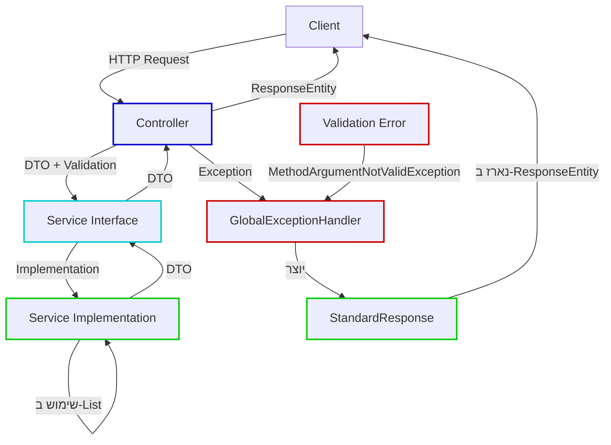
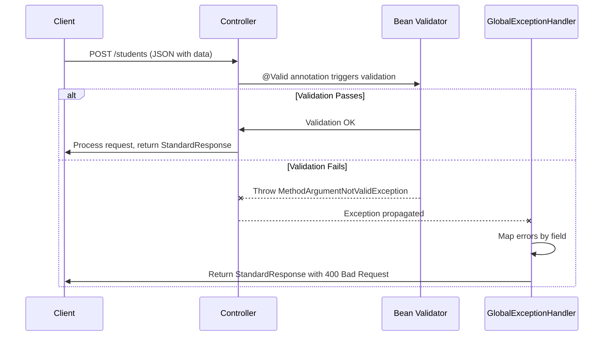
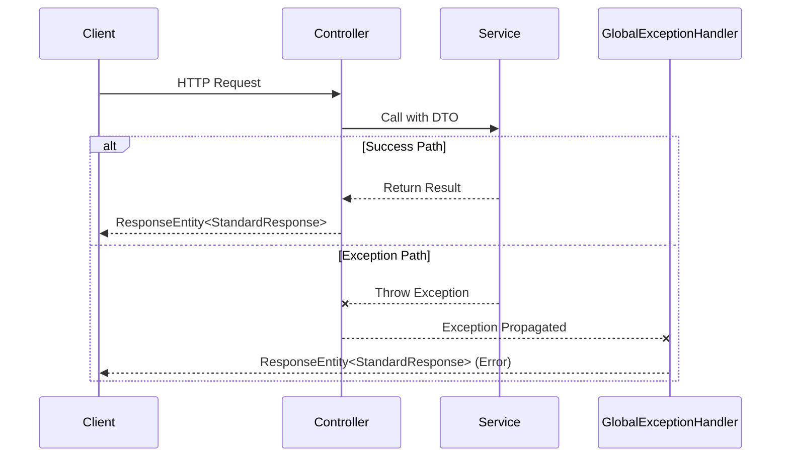
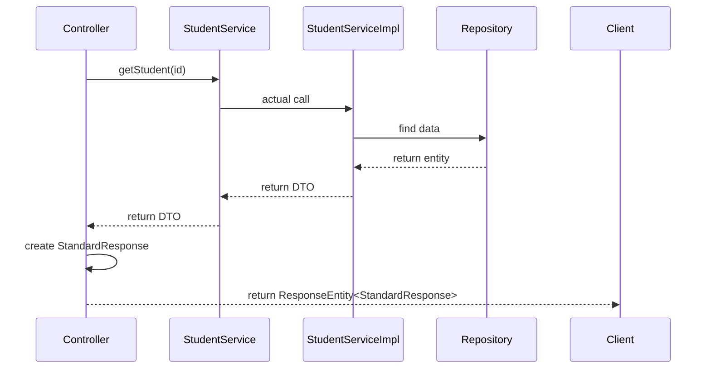

<div dir="rtl">

# שיפורים מתקדמים באפליקציית Spring Boot - Stage6

## תוכן עניינים
1. [מבוא](#מבוא)
2. [שימוש ב-DTO](#שימוש-ב-dto)
3. [Validation - מנגנון ולידציה](#validation---מנגנון-ולידציה)
4. [GlobalExceptionHandler - טיפול גלובלי בחריגות](#globalexceptionhandler---טיפול-גלובלי-בחריגות)
5. [StandardResponse - מבנה תגובה אחיד](#standardresponse---מבנה-תגובה-אחיד)
6. [ResponseEntity<StandardResponse> - תגובות אחידות](#responseentitystandardresponse---תגובות-אחידות)
7. [ממשק השירות (Service Interface)](#ממשק-השירות-service-interface)


## מבוא

מסמך זה מתאר את השיפורים שהוטמעו בשלב Stage6 של אפליקציית Spring Boot, המיועדים להפוך את ה-API שלנו למקצועי, עקבי וקל יותר לשימוש. השיפורים מתמקדים בהפרדת שכבות, טיפול מרכזי בחריגות ויצירת תשתית למבנה תגובה אחיד.

השיפורים העיקריים שיושמו בשלב Stage6:
- **שימוש ב-DTO** להפרדה בין ישויות פנימיות לייצוגים חיצוניים
- **מנגנון ולידציה (Validation)** לבדיקת תקינות הנתונים בכניסה למערכת
- **GlobalExceptionHandler** לטיפול מרכזי בחריגות
- **StandardResponse** כמבנה תגובה אחיד לכל סוגי התגובות
- **ResponseEntity<StandardResponse>** לשליטה בקודי סטטוס HTTP והחזרת תגובה במבנה אחיד
- **ממשקי שירות (Service Interfaces)** להפרדה בין הגדרת החוזה למימוש

### ארכיטקטורת המערכת בשלב Stage6

</div>



<div dir="rtl">

## שימוש ב-DTO

### מה זה DTO?

DTO (Data Transfer Object) הוא אובייקט המשמש להעברת נתונים בין שכבות במערכת, במיוחד בין השרת ללקוח.

### מימוש:

</div>

```java
@Data
@NoArgsConstructor
@AllArgsConstructor
public class StudentDto {
    private Long id;
    
    @NotBlank(message = "First name is required")
    @Size(min = 2, max = 50, message = "First name must be between 2 and 50 characters")
    private String firstName;
    
    @NotBlank(message = "Last name is required")
    @Size(min = 2, max = 50, message = "Last name must be between 2 and 50 characters")
    private String lastName;
    
    @Min(value = 0, message = "Age must be a positive number")
    private double age;
}
```

<div dir="rtl">

### יתרונות:

1. **הפרדת שכבות**: DTO מאפשר להפריד בין מודל הנתונים הפנימי (Entity) לבין הייצוג החיצוני
2. **שליטה במידע המוצג**: ניתן להציג רק את השדות הרלוונטיים ללקוח
3. **הגנה על הנתונים**: מניעת חשיפה של שדות רגישים
4. **גמישות**: שינויים במודל הפנימי לא משפיעים בהכרח על הממשק החיצוני
5. **ולידציה**: הוספת אנוטציות ולידציה ספציפיות עבור קלט משתמש

## Validation - מנגנון ולידציה

### חשיבות ולידציה בשכבת ה-API

ולידציה היא תהליך בדיקת תקינות של נתונים הנכנסים למערכת. ב-Stage6, אנו מיישמים מנגנון ולידציה מובנה המבוסס על Jakarta Bean Validation (לשעבר Hibernate Validator) שכולל:

1. **הגדרת כללי ולידציה** באמצעות אנוטציות על שדות ב-DTO
2. **הפעלת הולידציה** באמצעות האנוטציה @Valid בבקרים
3. **טיפול בשגיאות ולידציה** באמצעות GlobalExceptionHandler

### דוגמאות לאנוטציות ולידציה שכיחות:

</div>

```java
@NotNull        // שדה לא יכול להיות null
@NotBlank       // מחרוזת לא יכולה להיות ריקה או להכיל רק רווחים
@Size(min=2, max=50)  // אורך המחרוזת חייב להיות בטווח שהוגדר
@Min(0)         // ערך מספרי מינימלי
@Max(100)       // ערך מספרי מקסימלי
@Email          // מחרוזת חייבת להיות בפורמט של כתובת אימייל
@Pattern(regexp="...")  // מחרוזת חייבת להתאים לתבנית רגולרית
```

<div dir="rtl">

### הפעלת הולידציה בבקר:

</div>

```java
@PostMapping("/addStudent")
public ResponseEntity<StandardResponse> addStudent(@Valid @RequestBody StudentDto studentDto) {
    // האנוטציה @Valid מפעילה את תהליך הולידציה
    // אם יש שגיאות ולידציה, Spring יזרוק MethodArgumentNotValidException
    StudentDto added = studentService.addStudent(studentDto);
    
    // יוצרים URI עבור כותרת Location
    URI location = ServletUriComponentsBuilder
            .fromCurrentRequest()
            .path("/{id}")
            .buildAndExpand(added.getId())
            .toUri();
    
    // מחזירים תגובה במבנה אחיד
    StandardResponse response = new StandardResponse("success", added, null);
    return ResponseEntity.created(location).body(response);
}
```

<div dir="rtl">

### טיפול בשגיאות ולידציה:

ב-Stage6, GlobalExceptionHandler אחראי על לכידת חריגות ולידציה והמרתן לפורמט תגובה אחיד:

</div>

```java
@ExceptionHandler(MethodArgumentNotValidException.class)
public ResponseEntity<StandardResponse> handleValidationExceptions(
        MethodArgumentNotValidException ex, WebRequest request) {
    // מיפוי שגיאות הולידציה לפי שדה
    Map<String, String> errors = new HashMap<>();
    ex.getBindingResult().getFieldErrors().forEach(error ->
            errors.put(error.getField(), error.getDefaultMessage())
    );
    
    // יצירת תגובת שגיאה במבנה אחיד
    StandardResponse response = new StandardResponse("error", null, errors);
    return new ResponseEntity<>(response, HttpStatus.BAD_REQUEST);
}
```

<div dir="rtl">

### דוגמה לתגובת שגיאת ולידציה:

</div>

```json
{
  "status": "error",
  "data": null,
  "error": {
    "type": "Validation Failed",
    "fields": {
      "firstName": "First name must be between 2 and 50 characters",
      "lastName": "Last name is required",
      "age": "Age must be a positive number"
    }
  },
  "timestamp": "2023-08-06T15:31:22.456"
}
```

<div dir="rtl">

### תרשים זרימה של תהליך הולידציה:

</div>



<div dir="rtl">

## GlobalExceptionHandler - טיפול גלובלי בחריגות

### מהו GlobalExceptionHandler?

GlobalExceptionHandler הוא רכיב המרכז את הטיפול בכל החריגות במערכת במקום אחד, באמצעות האנוטציה `@ControllerAdvice`. זהו חידוש משמעותי שמפשט את הקוד ומייצר התנהגות עקבית.

### מימוש:

</div>

```java
@ControllerAdvice
public class GlobalExceptionHandler {

    @ExceptionHandler(NotExists.class)
    public ResponseEntity<StandardResponse> handleNotExists(NotExists ex, WebRequest request) {
        Map<String, String> details = new HashMap<>();
        details.put("type", "Resource Not Found");
        details.put("message", ex.getMessage());
        
        StandardResponse response = new StandardResponse("error", null, details);
        return new ResponseEntity<>(response, HttpStatus.NOT_FOUND);
    }
    
    @ExceptionHandler(AlreadyExists.class)
    public ResponseEntity<StandardResponse> handleAlreadyExists(AlreadyExists ex, WebRequest request) {
        Map<String, String> details = new HashMap<>();
        details.put("type", "Resource Conflict");
        details.put("message", ex.getMessage());
        
        StandardResponse response = new StandardResponse("error", null, details);
        return new ResponseEntity<>(response, HttpStatus.CONFLICT);
    }
    
    @ExceptionHandler(MethodArgumentNotValidException.class)
    public ResponseEntity<StandardResponse> handleValidationExceptions(
            MethodArgumentNotValidException ex, WebRequest request) {
        Map<String, String> errors = new HashMap<>();
        ex.getBindingResult().getFieldErrors().forEach(error ->
                errors.put(error.getField(), error.getDefaultMessage())
        );
        
        Map<String, Object> details = new HashMap<>();
        details.put("type", "Validation Failed");
        details.put("fields", errors);
        
        StandardResponse response = new StandardResponse("error", null, details);
        return new ResponseEntity<>(response, HttpStatus.BAD_REQUEST);
    }
    
    // מטפלים נוספים לסוגי חריגות שונים...
}
```

<div dir="rtl">

### יתרונות:

1. **ריכוזיות**: טיפול בכל החריגות במקום אחד
2. **הפרדת תחומי אחריות**: הבקרים מתמקדים בלוגיקה העסקית, לא בטיפול בשגיאות
3. **עקביות**: כל השגיאות מטופלות באותו אופן
4. **קוד נקי יותר**: הימנעות מכפילות קוד try-catch בכל הבקרים
5. **קלות תחזוקה**: שינויים באופן הטיפול בשגיאות נעשים במקום אחד

### הבעיות שהוא פותר:

1. כפילות קוד טיפול בשגיאות בבקרים שונים
2. חוסר עקביות בתגובות שגיאה
3. קושי בתחזוקה של לוגיקת טיפול בשגיאות
4. קוד בקר מסורבל עם בלוקים רבים של try-catch

### תרשים זרימה של טיפול בחריגות

</div>



<div dir="rtl">

## StandardResponse - מבנה תגובה אחיד

StandardResponse היא מחלקה המשמשת ליצירת מבנה תגובה אחיד לכל סוגי התגובות במערכת, הן להצלחות והן לשגיאות.

### מימוש:

</div>

```java
@Data
@NoArgsConstructor
@AllArgsConstructor
public class StandardResponse {
    /**
     * Status of the response (success, error, warning, etc.)
     */
    private String status;
    
    /**
     * Payload data of the response
     */
    private Object data;
    
    /**
     * Error object in case of errors
     */
    private Object error;
    
    /**
     * Timestamp of the response
     */
    private LocalDateTime timestamp;
    
    public StandardResponse(String status, Object data, Object error) {
        this.status = status;
        this.data = data;
        this.error = error;
        this.timestamp = LocalDateTime.now();
    }
}
```

<div dir="rtl">

#### יתרונות:

1. **עקביות**: כל התגובות יגיעו במבנה זהה
2. **שקיפות**: תמיד יהיה ברור אם התגובה היא הצלחה או שגיאה
3. **מידע נוסף**: אפשרות להוסיף מטא-נתונים כמו חותמת זמן
4. **גמישות**: התאמה קלה לדרישות עתידיות

## ResponseEntity<StandardResponse> - תגובות אחידות

אחד השיפורים המשמעותיים בשלב Stage6 הוא השימוש ב-`ResponseEntity<StandardResponse>` עבור כל תגובות ה-API. זה מאפשר לנו לספק מבנה תגובה אחיד תוך שליטה מלאה בקודי הסטטוס של HTTP ובכותרות התגובה.

### יתרונות:

1. **מבנה תגובה אחיד** - לקוחות יכולים לצפות לאותו מבנה תגובה בכל פעם
2. **שליטה בקודי סטטוס HTTP** - החזרת קודי סטטוס מתאימים כגון 200, 201, 204, 400, 404, וכו'
3. **תוספת כותרות** - אפשר להוסיף כותרות חשובות כמו `Location` בעת יצירת משאב חדש
4. **מידע עשיר יותר** - שילוב של מידע בגוף התגובה עם מידע בכותרות וקודי סטטוס

### תגובה במקרה של הצלחה:

</div>

```json
{
  "status": "success",
  "data": {
    "id": 99,
    "firstName": "ישראל",
    "lastName": "ישראלי",
    "age": 21
  },
  "error": null,
  "timestamp": "2023-08-06T15:25:45.123"
}
```

<div dir="rtl">

### תגובה במקרה של שגיאה:

</div>

```json
{
  "status": "error",
  "data": null,
  "error": {
    "type": "Resource Not Found",
    "message": "Student with id 999 does not exist"
  },
  "timestamp": "2023-08-06T15:23:45.123"
}
```

<div dir="rtl">

### דוגמאות לשימוש ב-ResponseEntity<StandardResponse> בבקר:

</div>

```java
// שליפת כל התלמידים
@GetMapping("/getAllStudents")
public ResponseEntity<StandardResponse> getAllStudents() {
    List<StudentDto> students = studentService.getAllStudents();
    StandardResponse response = new StandardResponse("success", students, null);
    return ResponseEntity.ok(response); // 200 OK
}

// שליפת תלמיד לפי מזהה
@GetMapping("/getStudent/{id}")
public ResponseEntity<StandardResponse> getStudent(@PathVariable Long id) {
    StudentDto student = studentService.getStudent(id);
    StandardResponse response = new StandardResponse("success", student, null);
    return ResponseEntity.ok(response); // 200 OK
}

// הוספת תלמיד חדש
@PostMapping("/addStudent")
public ResponseEntity<StandardResponse> addStudent(@Valid @RequestBody StudentDto studentDto) {
    StudentDto added = studentService.addStudent(studentDto);
    
    URI location = ServletUriComponentsBuilder
            .fromCurrentRequest()
            .path("/{id}")
            .buildAndExpand(added.getId())
            .toUri();
    
    StandardResponse response = new StandardResponse("success", added, null);
    return ResponseEntity.created(location).body(response); // 201 Created
}

// מחיקת תלמיד
@DeleteMapping("/deleteStudent/{id}")
public ResponseEntity<Void> deleteStudent(@PathVariable Long id) {
    studentService.deleteStudent(id);
    return ResponseEntity.noContent().build(); // 204 No Content, no response body
}
```

<div dir="rtl">

### קודי סטטוס HTTP שבשימוש:

- **200 OK** - הבקשה בוצעה בהצלחה (עבור GET, PUT)
- **201 Created** - משאב חדש נוצר בהצלחה (עבור POST)
- **204 No Content** - הבקשה בוצעה בהצלחה, אין תוכן להחזיר (עבור DELETE)
- **400 Bad Request** - שגיאת ולידציה או בקשה לא תקינה
- **404 Not Found** - המשאב המבוקש לא נמצא
- **409 Conflict** - התנגשות (למשל כאשר מנסים להוסיף משאב שכבר קיים)
- **500 Internal Server Error** - שגיאה כללית בשרת

## ממשק השירות (Service Interface)

### חשיבות השימוש בממשקי שירות

בשלב Stage6, אנו מיישמים את שכבת השירות באמצעות ממשקים (Interfaces). זוהי שיטה מועדפת בפיתוח שמבוססת על עקרונות SOLID ומספקת יתרונות משמעותיים:

</div>

```java
public interface StudentService {
    /**
     * Get all students from the system
     * @return List of all students as DTOs
     */
    List<StudentDto> getAllStudents();
    
    /**
     * Get student by ID
     * @param id The student ID to retrieve
     * @return The found student as DTO
     * @throws NotExists If student doesn't exist
     */
    StudentDto getStudent(Long id);
    
    /**
     * Add a new student
     * @param studentDto Student data to add
     * @return The added student as DTO
     * @throws AlreadyExists If a student with the same ID already exists
     */
    StudentDto addStudent(StudentDto studentDto);
    
    /**
     * Update an existing student
     * @param studentDto Updated student data
     * @param id The ID from the path parameter
     * @return The updated student as DTO
     * @throws NotExists If a student doesn't exist
     * @throws StudentIdAndIdMismatch If ID in path doesn't match student ID
     */
    StudentDto updateStudent(StudentDto studentDto, Long id);
    
    /**
     * Delete a student by ID
     * @param id Student ID to delete
     * @throws NotExists If a student doesn't exist
     */
    void deleteStudent(Long id);
}
```

<div dir="rtl">

### יתרונות השימוש בממשק השירות:

1. **הפרדת ממשק ממימוש (Interface Segregation Principle)** - הממשק מגדיר חוזה ברור בין הבקר לשירות, ללא תלות במימוש הספציפי
2. **יכולת החלפה וגמישות (Dependency Inversion Principle)** - ניתן להחליף את המימוש בלי לשנות את הקוד שמשתמש בשירות
3. **חוזה ברור** - הממשק מספק תיעוד ברור של הפעולות וההתנהגויות שהשירות מספק
4. **בדיקות פשוטות יותר** - קל יותר ליצור mock לממשק בבדיקות יחידה
5. **מודולריות** - הפרדה טובה יותר בין רכיבי המערכת

### דוגמה למימוש הממשק:

</div>

```java
@Service
public class StudentServiceImpl implements StudentService {
    
    private final List<Student> students = new ArrayList<>(Arrays.asList(
        new Student(1L, "Alice", "Moskovitz", 21.3),
        new Student(2L, "Bob", "Smith", 22.3),
        new Student(3L, "Charlie", "Brown", 23.3)
    ));
    
    private final StudentMapper studentMapper;
    
    public StudentServiceImpl(StudentMapper studentMapper) {
        this.studentMapper = studentMapper;
    }

    @Override
    public List<StudentDto> getAllStudents() {
        return students.stream()
                .map(studentMapper::toDto)
                .collect(Collectors.toList());
    }
    
    @Override
    public StudentDto getStudent(Long id) {
        Student student = findStudentById(id);
        return studentMapper.toDto(student);
    }
    
    // יתר המימושים...
    
    private Student findStudentById(Long id) {
        return students.stream()
                .filter(s -> s.getId().equals(id))
                .findFirst()
                .orElseThrow(() -> new NotExists("Student with id " + id + " does not exist"));
    }
}
```

<div dir="rtl">

### שימוש בממשק בבקר:

</div>

```java
@RestController
@RequestMapping("/student")
public class StudentController {
    
    private final StudentService studentService; // ממשק, לא מימוש
    
    public StudentController(StudentService studentService) {
        this.studentService = studentService;
    }
    
    @GetMapping("/getStudent/{id}")
    public ResponseEntity<StandardResponse> getStudent(@PathVariable Long id) {
        StudentDto student = studentService.getStudent(id);
        StandardResponse response = new StandardResponse("success", student, null);
        return ResponseEntity.ok(response);
    }
    
    // שאר המתודות...
}
```

<div dir="rtl">

### תרשים זרימה של עבודה עם ממשק השירות

</div>



<div dir="rtl">

## סיכום השיפורים 

השיפורים שהוטמעו בשלב Stage6 באפליקציית Spring Boot שלנו משפרים משמעותית את איכות הקוד ואת חוויית המפתח והמשתמש:

1. **מימוש נוכחי (Stage6)**:
   - שימוש ב-DTO להפרדת שכבות והגדרת ולידציה
   - מנגנון ולידציה מבוסס אנוטציות עם טיפול מרכזי בשגיאות ולידציה
   - יישום GlobalExceptionHandler לטיפול מרכזי בחריגות
   - StandardResponse עבור מבנה תגובה אחיד
   - ResponseEntity<StandardResponse> לשליטה בקודי סטטוס HTTP והחזרת תגובות אחידות
   - שימוש בממשקי שירות להפרדה בין הגדרת החוזה למימוש

הטמענו את כל השיפורים האלה ויצרנו API מקצועי ועקבי שהוא:
- קל לשימוש עבור לקוחות ה-API
- פשוט לתחזוקה
- נקי מבחינת קוד
- גמיש לשינויים עתידיים

באמצעות השימוש ב-`ResponseEntity<StandardResponse>` הצלחנו לספק:
1. מבנה תגובה אחיד בכל המערכת
2. שליטה מלאה בקודי הסטטוס HTTP
3. יכולת להוסיף כותרות מיוחדות (כמו Location)
4. שקיפות לגבי הצלחה או כישלון של הבקשות

</div>