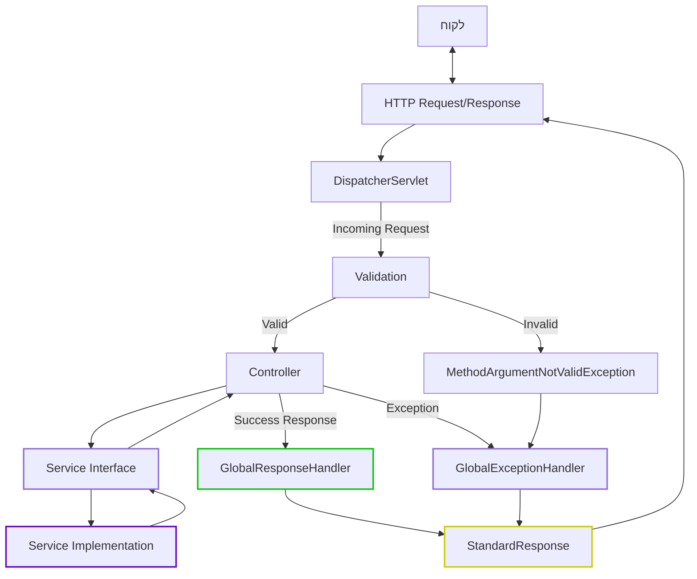
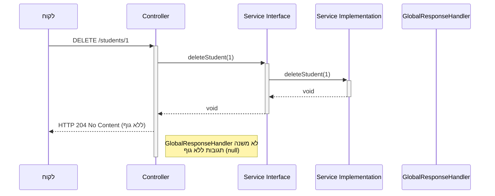
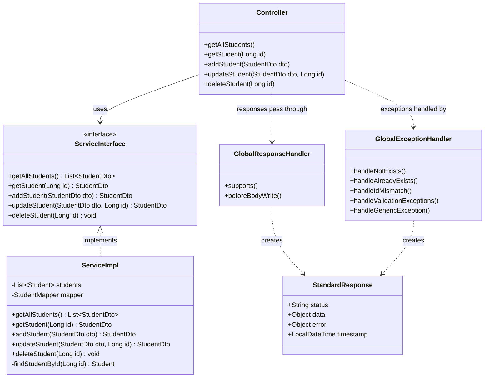

<div dir="rtl">

# מנגנון תגובות אחיד וטיפול בחריגות במערכת Spring Boot - Stage7

## תוכן עניינים

1. [מבוא](#מבוא)
2. [GlobalResponseHandler - הרכיב החדש המרכזי](#globalresponsehandler---הרכיב-החדש-המרכזי)
3. [ממשק השירות (Service Interface)](#ממשק-השירות-service-interface)
4. [ארכיטקטורת המערכת המשולבת](#ארכיטקטורת-המערכת-המשולבת)
5. [תהליך זרימת הבקשות והתגובות](#תהליך-זרימת-הבקשות-והתגובות)
6. [התנהגות מיוחדת עבור תגובות 204](#התנהגות-מיוחדת-עבור-תגובות-204-no-content)
7. [שיקולי הנדסת תוכנה](#שיקולי-הנדסת-תוכנה)
8. [דוגמאות מפורטות לתגובות](#דוגמאות-מפורטות-לתגובות)

## מבוא

מסמך זה מתמקד בשלב Stage7 של פיתוח המערכת, שבו הוספנו את GlobalResponseHandler ליצירת מנגנון תגובות אחיד ושלם. בשלב הקודם (Stage6) יישמנו את GlobalExceptionHandler וStandardResponse לטיפול בחריגות, וכעת אנו משלימים את התמונה עם רכיב שמטפל בתגובות הצלחה.

## GlobalResponseHandler - הרכיב החדש המרכזי

`GlobalResponseHandler` הוא הרכיב החדש המרכזי ב-Stage7. הוא אחראי על עטיפה אוטומטית של כל התגובות במבנה האחיד. הוא פועל כ"שומר שער" לכל התגובות היוצאות מהמערכת:

</div>

```java
@ControllerAdvice
public class GlobalResponseHandler implements ResponseBodyAdvice<Object> {
    
    @Override
    public boolean supports(MethodParameter returnType, Class<? extends HttpMessageConverter<?>> converterType) {
        return true; // מטפל בכל סוגי התגובות
    }
    
    @Override
    public Object beforeBodyWrite(Object body, 
                                 MethodParameter returnType, 
                                 MediaType selectedContentType,
                                 Class<? extends HttpMessageConverter<?>> selectedConverterType, 
                                 ServerHttpRequest request, 
                                 ServerHttpResponse response) {
        
        // טיפול בתגובות 204 (No Content)
        if (response.getHeaders().getFirst("X-Response-Status") != null && 
            response.getHeaders().getFirst("X-Response-Status").equals("204")) {
            return body; // לא משנה תגובות 204
        }
        
        // אם התגובה כבר עטופה ב-StandardResponse, החזר אותה כמו שהיא
        if (body instanceof StandardResponse) {
            return body;
        }
        
        // טיפול בתגובות ErrorResponse
        if (body instanceof ErrorResponse) {
            ErrorResponse errorResponse = (ErrorResponse) body;
            return new StandardResponse("error", null, errorResponse);
        }
        
        // טיפול מיוחד ב-null (בד"כ מתגובות 204 No Content)
        if (body == null) {
            return null; // לא עוטף null כדי לא לפגוע בתגובות 204
        }
        
        // טיפול בהודעות שגיאה
        if (body instanceof String && ((String) body).contains("error")) {
            return new StandardResponse("error", null, body);
        }
        
        // ברירת מחדל: עטיפת גוף התגובה ב-StandardResponse
        return new StandardResponse("success", body, null);
    }
}
```

<div dir="rtl">

**חידושים ויתרונות מרכזיים**:
- **אוטומטיות מלאה** - כל תגובה מעוטפת ללא צורך בקוד נוסף בבקרים
- **שקיפות למפתח** - הבקרים יכולים להחזיר אובייקטים רגילים או DTO
- **אינטגרציה עם GlobalExceptionHandler** - מזהה תגובות שכבר עטופות ע"י מנגנון החריגות
- **טיפול מיוחד במקרים שונים** - התייחסות ייחודית לתגובות 204, null ורגליים לשגיאות

## ממשק השירות (Service Interface)

ב-Stage7 אנו מממשים את מערכת השירותים באמצעות ממשקים (Interfaces) במקום מחלקות קונקרטיות ישירות. גישה זו מחזקת את עקרונות הגמישות והתחזוקתיות:

</div>

```java
public interface StudentService {
    /**
     * Get all students from the system as DTOs
     * @return List of all students as DTOs
     */
    List<StudentDto> getAllStudents();
    
    /**
     * Get student by ID as DTO
     * @param id The student ID to retrieve
     * @return The found student as DTO
     * @throws NotExists If student doesn't exist
     */
    StudentDto getStudent(Long id);
    
    /**
     * Add a new student
     * @param studentDto Student data to add (as DTO)
     * @return The added student as DTO
     * @throws AlreadyExists If a student with the same ID already exists
     */
    StudentDto addStudent(StudentDto studentDto);
    
    /**
     * Update an existing student
     * @param studentDto Updated student data (as DTO)
     * @param id The ID from the path parameter
     * @return The updated student as DTO
     * @throws NotExists If a student doesn't exist
     * @throws StudentIdAndIdMismatch If ID in a path doesn't match student ID
     */
    StudentDto updateStudent(StudentDto studentDto, Long id);
    
    /**
     * Delete a student by ID
     * @param id Student ID to delete
     * @throws NotExists If a student doesn't exist
     */
    void deleteStudent(Long id);
}
```

<div dir="rtl">

**יתרונות השימוש בממשק השירות**:
- **הפרדת ממשק ממימוש** - בהתאם לעקרון הפרדת הממשק (Interface Segregation Principle)
- **תיעוד ברור של דרישות ותנאים** - Javadoc מתאר היטב את הפונקציונליות ואת החריגות האפשריות
- **יכולת החלפת מימושים** - ניתן להחליף את מימוש השירות ללא שינוי בקוד המשתמש
- **יכולת מוקינג בבדיקות** - קל יותר לכתוב בדיקות עם mock למימושי הממשק
- **הסכמה ברורה** - יצירת "חוזה" ברור בין הבקר לבין שכבת השירות

המימוש של ממשק זה עובד ישירות עם DTO וזורק חריגות מוגדרות היטב שמטופלות ע"י GlobalExceptionHandler:

</div>

```java
@Service
public class StudentServiceImpl implements StudentService {

    private final List<Student> students = new ArrayList<>(Arrays.asList(
        new Student(1L, "Alice", "Moskovitz", 21.3),
        new Student(2L, "Bob", "Smith", 22.3),
        new Student(3L, "Charlie", "Brown", 23.3),
        new Student(4L, "David", "Miller", 24.3)
    ));
    
    private final StudentMapper studentMapper;
    
    public StudentServiceImpl(StudentMapper studentMapper) {
        this.studentMapper = studentMapper;
    }

    @Override
    public List<StudentDto> getAllStudents() {
        // Convert all entities to DTOs
        return students.stream()
                .map(studentMapper::toDto)
                .collect(Collectors.toList());
    }

    @Override
    public StudentDto getStudent(Long id) {
        // Find entity and convert to DTO
        Student student = findStudentById(id);
        return studentMapper.toDto(student);
    }
    
    // מימוש שאר המתודות...
    
    private Student findStudentById(Long id) {
        return students.stream()
                .filter(s -> s.getId().equals(id))
                .findFirst()
                .orElseThrow(() -> new NotExists("Student with id " + id + " does not exist"));
    }
}
```

<div dir="rtl">

## ארכיטקטורת המערכת המשולבת

תרשים זה מציג את מקומו של GlobalResponseHandler במערכת המשולבת:

</div>



<div dir="rtl">

## תהליך זרימת הבקשות והתגובות

תרשים הרצף הבא מדגים את זרימת הבקשה והתגובה דרך המערכת, כולל האינטראקציה בין GlobalResponseHandler ו-GlobalExceptionHandler:

```mermaid
sequenceDiagram
    participant Client as לקוח
    participant SC as Controller
    participant SI as Service Interface
    participant SM as Service Implementation
    participant GRH as GlobalResponseHandler
    participant GEH as GlobalExceptionHandler
    
    %% תרחיש GET מוצלח
    rect rgb(0, 80, 0)
    note right of Client: GET מוצלח
    Client->>+SC: GET /students
    SC->>+SI: getAllStudents()
    SI->>+SM: מימוש של getAllStudents()
    SM-->>-SI: List<Student>
    SI-->>-SC: List<StudentDto>
    SC-->>GRH: List<StudentDto>
    GRH->>GRH: עטיפה ב-StandardResponse
    GRH-->>Client: StandardResponse
    deactivate SC
    end
    
    %% תרחיש GET עם שגיאה
    rect rgb(80, 0, 0)
    note right of Client: GET עם שגיאה
    Client->>+SC: GET /students/999
    SC->>+SI: getStudent(999)
    SI->>+SM: findStudentById(999)
    SM->>GEH: throw NotExists Exception
    GEH->>GEH: יצירת StandardResponse<br>("error", null, errorInfo)
    GEH-->>GRH: ResponseEntity<StandardResponse>
    GRH->>GRH: זיהוי StandardResponse קיים
    GRH-->>Client: StandardResponse + HTTP 404
    deactivate SC
    deactivate SI
    deactivate SM
    end
```

</div>



<div dir="rtl">

## התנהגות מיוחדת עבור תגובות 204 (No Content)

תגובות 204 מהוות מקרה מיוחד במנגנון התגובות האחיד. לפי הגדרת HTTP, תגובת 204 מציינת הצלחה אך ללא גוף תגובה.

### מימוש בבקר

</div>

```java
@DeleteMapping("/{id}")
@ResponseStatus(HttpStatus.NO_CONTENT)  // קובע את סטטוס התגובה ל-204
public void deleteStudent(@PathVariable Long id) {
    studentService.deleteStudent(id);
    // החזרת void יוצרת תגובה ללא גוף
}
```

<div dir="rtl">

### תהליך הזרימה במחיקה (204)

</div>



<div dir="rtl">

## שיקולי הנדסת תוכנה

### עקרונות תכנון שיושמו ב-Stage7

1. **עקרון האחריות היחידה (SRP)** - GlobalResponseHandler אחראי רק על עיטוף תגובות הצלחה
2. **הפרדת ממשק ממימוש (ISP)** - שימוש בממשקי שירות מאפשר הפרדה בין הגדרת חוזה למימוש
3. **עקרון פתוח-סגור (OCP)** - מערכת התגובות ניתנת להרחבה ללא שינוי ברכיבים קיימים
4. **עקרון DRY (Don't Repeat Yourself)** - הגדרה מרכזית של פורמט תגובה במקום חזרה בכל בקר
5. **תכנות מונחה היבטים (AOP)** - עטיפת תגובות כהיבט חוצה-מערכת (cross-cutting concern)

### דיאגרמת הקשר בין הרכיבים

</div>



<div dir="rtl">

## דוגמאות מפורטות לתגובות

### 1. תגובת הצלחה (200 OK) לאחר עיטוף אוטומטי

</div>

```json
{
  "status": "success",
  "data": [
    { "id": 1, "firstName": "Alice", "lastName": "Moskovitz", "age": 21.3 },
    { "id": 2, "firstName": "Bob", "lastName": "Smith", "age": 22.3 }
  ],
  "error": null,
  "timestamp": "2025-04-23T15:30:45.123"
}
```

<div dir="rtl">

### 2. שגיאת ולידציה (400 Bad Request)

</div>

```json
{
  "status": "error",
  "data": null,
  "error": {
    "type": "Validation Failed",
    "fields": {
      "firstName": "First name must be between 2 and 50 characters",
      "lastName": "Last name is required",
      "age": "Age must be a positive number"
    }
  },
  "timestamp": "2025-04-23T15:31:22.456"
}
```

<div dir="rtl">

### 3. תגובת יצירה (201 Created)

</div>

```json
{
  "status": "success",
  "data": {
    "id": 5,
    "firstName": "Eric",
    "lastName": "Johnson",
    "age": 25.0
  },
  "error": null,
  "timestamp": "2025-04-23T15:35:12.789"
}
```

<div dir="rtl">

##  והשוואה בין Stage6 ל-Stage7

| תכונה | Stage6                                | Stage7                                   |
|-------|---------------------------------------|------------------------------------------|
| **עטיפת תגובות שגיאה** | כן, באמצעות GlobalExceptionHandler    | כן, באמצעות GlobalExceptionHandler       |
| **עטיפת תגובות הצלחה** | לא, תגובות חוזרות כ-JSON רגיל         | כן, כל התגובות עטופות אוטומטית           |
| **מבנה תגובה אחיד** | חלקי (רק שגיאות)                      | מלא (שגיאות והצלחות)                     |
| **קוד נדרש בבקרים** | החזרת אובייקטים ישירות                | החזרת אובייקטים ישירות (העטיפה אוטומטית) |
| **עומס על המפתח** | בינוני                                | נמוך (רוב הלוגיקה מופשטת בממשקים)        |
| **ממשקי שירות** | לא הכרחי                              | מיושם באופן מלא                          |
| **תפיסת API** | מחולק (שגיאות במבנה אחד, הצלחות באחר) | אחיד לחלוטין                             |

Stage7 מייצג מערכת API בוגרת ומקצועית, עם הפרדת אחריות ברורה, ממשקים מוגדרים היטב, ותפיסת API עקבית ואחידה לחלוטין. השדרוג המשמעותי ביותר הוא הוספת GlobalResponseHandler ליצירת מעטפת אחידה לכל סוגי התגובות, מה שמשפר את חוויית הלקוח ומפשט את פיתוח צד הלקוח.

</div>