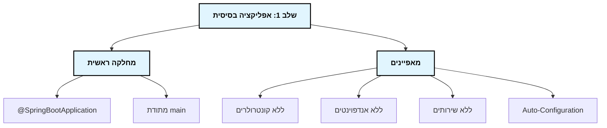
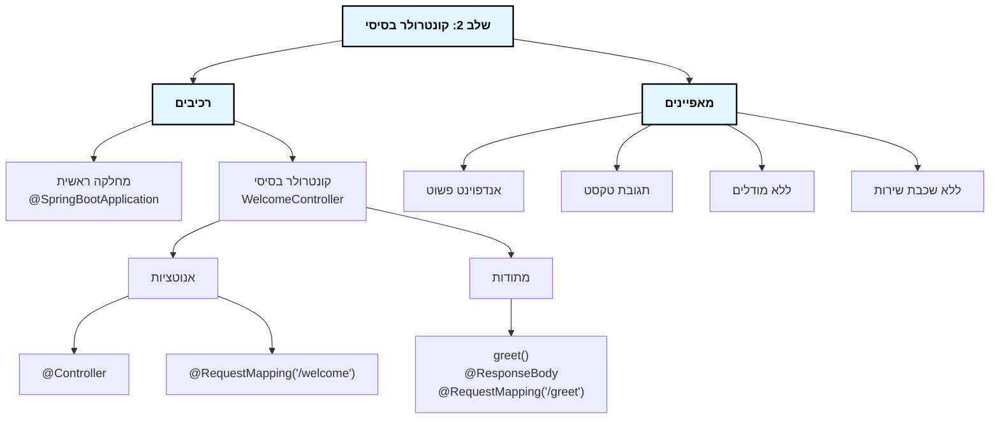
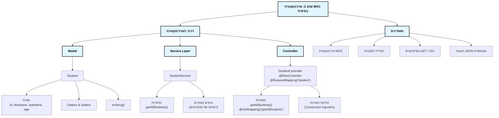
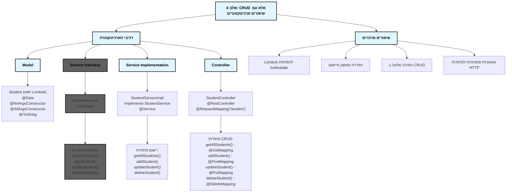
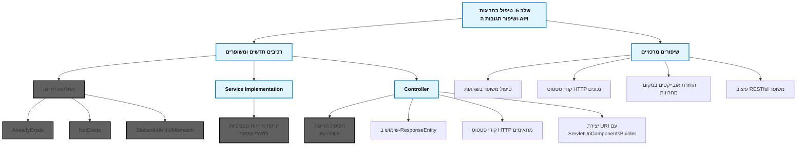
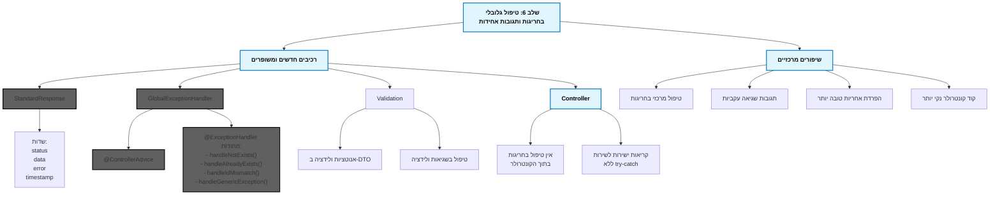
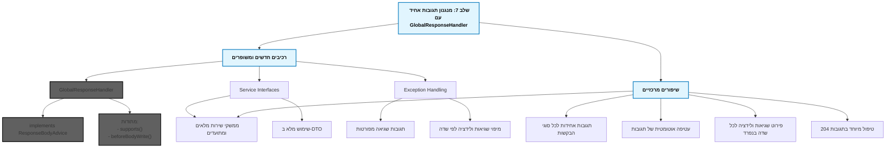

# מפת דרכים לפיתוח אפליקציית CRUD ב-Spring Boot

## סקירה כללית
מסמך זה מתאר את המסלול המדורג לפיתוח אפליקציית CRUD מלאה ב-Spring Boot, החל מיישום בסיסי ביותר ועד ליישום מתקדם עם טיפול בחריגות, ולידציה, ועקרונות ארכיטקטורה מודרניים.

## מסלול הפיתוח - סקירת השלבים

### שלב 1: אפליקציה בסיסית

בשלב זה אנו יוצרים רק את השלד המינימלי של אפליקציית Spring Boot - הקלאס הראשי עם האנוטציה `@SpringBootApplication`. זוהי אפליקציה שמתחילה לרוץ אך לא עושה שום דבר.

**קונספטים מרכזיים:**
- Spring Boot Auto-Configuration
- נקודת כניסה לאפליקציה (Entry Point)

### שלב 2: קונטרולר בסיסי

בשלב זה אנו מוסיפים קונטרולר פשוט עם אנדפוינט אחד שמחזיר טקסט. זוהי אפליקציית REST בסיסית ביותר.

**קונספטים מרכזיים:**
- Spring MVC
- Annotations: @Controller, @RequestMapping, @ResponseBody
- HTTP Request Handling

### שלב 3: ארכיטקטורת MVC בסיסית

בשלב זה אנו מיישמים ארכיטקטורת MVC עם הפרדה לשכבות: מודל, שירות וקונטרולר. אנו מממשים גם פונקציונליות בסיסית לקריאת נתונים.

**קונספטים מרכזיים:**
- ארכיטקטורת Model-View-Controller (MVC)
- הפרדה לשכבות (Separation of Concerns)
- Data Models
- Service Layer
- @RestController

### שלב 4: CRUD מלא עם שיפורים ארכיטקטוניים

בשלב זה אנו משדרגים את האפליקציה:
1. מיישמים את כל פעולות ה-CRUD (יצירה, קריאה, עדכון, מחיקה)
2. מוסיפים **הפרדה בין ממשק השירות למימוש שלו** - שיפור ארכיטקטוני חשוב
3. משתמשים ב-Lombok להפחתת קוד boilerplate
4. משתמשים באנוטציות ספציפיות לפעולות HTTP

**קונספטים מרכזיים:**
- CRUD Operations
- Interface-based Architecture
- Lombok
- RESTful API Design

### שלב 5: טיפול בחריגות ושיפור תגובות ה-API

בשלב זה אנו משפרים את:
1. טיפול בחריגות - מוסיפים מחלקות חריגה ייעודיות ותופסים אותן בקונטרולר
2. תגובות ה-API - משתמשים ב-ResponseEntity לשליטה בקודי סטטוס ובגוף התגובה
3. מחזירים אובייקטים מלאים במקום מחרוזות פשוטות

**קונספטים מרכזיים:**
- Custom Exceptions
- Exception Handling (try-catch)
- ResponseEntity
- HTTP Status Codes

### שלב 6: טיפול גלובלי בחריגות ותגובות אחידות

בשלב זה אנו:
1. מעבירים את טיפול החריגות מהקונטרולרים למחלקה גלובלית אחת (GlobalExceptionHandler)
2. משתמשים ב-@ControllerAdvice לטיפול מרכזי בחריגות
3. יוצרים מחלקת StandardResponse למבנה אחיד של תגובות (בינתיים רק לשגיאות)
4. מוסיפים ולידציה בסיסית עם אנוטציות והטיפול בשגיאות ולידציה ב-GlobalExceptionHandler

**קונספטים מרכזיים:**
- @ControllerAdvice
- @ExceptionHandler
- Global Exception Handling
- Standardized Error Responses
- Bean Validation

### שלב 7: מנגנון תגובות אחיד עם GlobalResponseHandler

בשלב זה אנו:
1. מוסיפים GlobalResponseHandler ליצירת מנגנון תגובות אחיד לכל סוגי הבקשות (הצלחה ושגיאה)
2. מיישמים ממשק ResponseBodyAdvice לעטיפה אוטומטית של כל התגובות במבנה StandardResponse
3. משפרים את השימוש בממשקי שירות עם תיעוד Javadoc מפורט
4. מרחיבים את מיפוי שגיאות הולידציה לפי שדה
5. מוסיפים טיפול מיוחד בתגובות 204 (No Content)

**קונספטים מרכזיים:**
- ResponseBodyAdvice
- Unified API Responses
- Aspect-Oriented Programming (AOP)
- RESTful API Best Practices
- No-Content (204) Response Handling

## שלבים עתידיים אפשריים

### שלב 8: שכבת גישה לנתונים (Data Access Layer)
התחברות למסד נתונים אמיתי באמצעות Spring Data JPA / Hibernate.

### שלב 9: אבטחה (Security)
הוספת אבטחה באמצעות Spring Security, אימות משתמשים והרשאות.

### שלב 10: מיקרוסרוויסים ו-Cloud Native
פיתוח ארכיטקטורת מיקרוסרוויסים עם תמיכה במאפייני Cloud Native.

