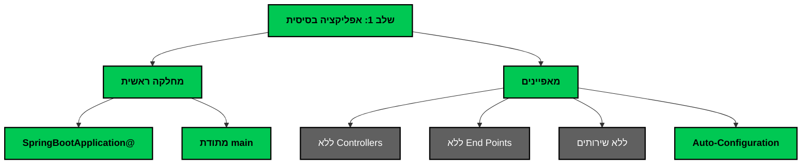
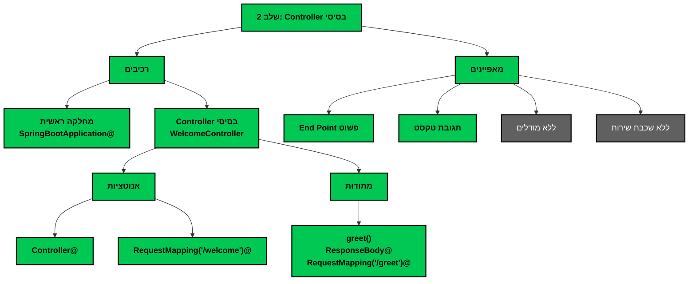
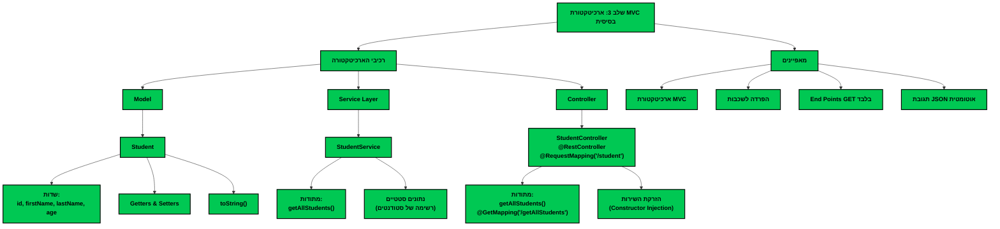
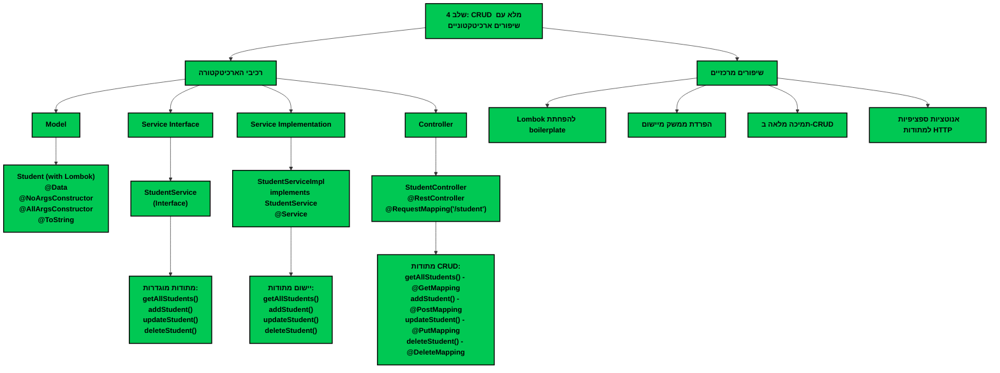
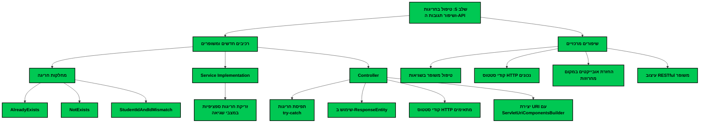

# מפת דרכים לפיתוח אפליקציית CRUD ב-Spring Boot

## סקירה כללית
תיאור המסלול המדורג לפיתוח אפליקציית CRUD מלאה ב-Spring Boot, החל מיישום בסיסי ביותר ועד ליישום מתקדם עם טיפול בחריגות, ולידציה, ועקרונות ארכיטקטורה מודרניים.

## מסלול הפיתוח - סקירת השלבים

### שלב 1: אפליקציה בסיסית

בשלב זה אנו יוצרים רק את השלד המינימלי של אפליקציית Spring Boot - המחלקה הראשי עם האנוטציה `SpringBootApplication@`. זוהי אפליקציה שמתחילה לרוץ אך לא עושה שום דבר.

**קונספטים מרכזיים:**
- Spring Boot Auto-Configuration
- נקודת כניסה לאפליקציה (Entry Point)

### שלב 2: Controller בסיסי

בשלב זה אנו מוסיפים Controller פשוט עם End Point אחד שמחזיר טקסט. זוהי אפליקציית REST בסיסית ביותר.

**קונספטים מרכזיים:**
- Spring MVC
- Annotations: @Controller, @RequestMapping, @ResponseBody
- HTTP Request Handling

### שלב 3: ארכיטקטורת MVC בסיסית

בשלב זה אנו מיישמים ארכיטקטורת MVC עם הפרדה לשכבות: מודל, שירות וController. אנו מממשים גם פונקציונליות בסיסית לקריאת נתונים.

**קונספטים מרכזיים:**
- ארכיטקטורת Model-View-Controller (MVC)
- הפרדה לשכבות (Separation of Concerns)
- Data Models
- Service Layer
- RestController@

### שלב 4: CRUD מלא עם שיפורים ארכיטקטוניים

בשלב זה אנו משדרגים את האפליקציה:
1. מיישמים את כל פעולות ה-CRUD (יצירה, קריאה, עדכון, מחיקה)
2. מוסיפים **הפרדה בין ממשק השירות למימוש שלו** - שיפור ארכיטקטוני חשוב
3. משתמשים ב-Lombok להפחתת קוד boilerplate
4. משתמשים באנוטציות ספציפיות לפעולות HTTP

**קונספטים מרכזיים:**
- CRUD Operations
- Interface-based Architecture
- Lombok
- RESTful API Design

### שלב 5: טיפול בחריגות ושיפור תגובות ה-API

בשלב זה אנו משפרים את:
1. טיפול בחריגות - מוסיפים מחלקות חריגה ייעודיות ותופסים אותן בController
2. תגובות ה-API - משתמשים ב-ResponseEntity לשליטה בקודי סטטוס ובגוף התגובה
3. מחזירים אובייקטים מלאים במקום מחרוזות פשוטות

**קונספטים מרכזיים:**
- Custom Exceptions
- Exception Handling (try-catch)
- ResponseEntity
- HTTP Status Codes

### שלב 6: טיפול גלובלי בחריגות ומנגנון תגובות אחיד

```mermaid
flowchart TD
    Stage6["שלב 6: טיפול גלובלי בחריגות ומנגנון תגובות אחיד"] --> Components["רכיבים חדשים ומשופרים"]
    
    Components --> StandardResponse["StandardResponse"]
    StandardResponse --> ResponseFields["שדות:<br>status<br>data<br>error<br>timestamp"]
    
    Components --> ExceptionHandler["GlobalExceptionHandler"]
    ExceptionHandler --> ControllerAdvice["@ControllerAdvice"]
    ExceptionHandler --> ExHandlerMethods["@ExceptionHandler מתודות:<br>- handleNotExists()<br>- handleAlreadyExists()<br>- handleIdMismatch()<br>- handleGenericException()"]
    
    Components --> Validation["Validation"]
    Validation --> DTOValidation["אנוטציות ולידציה ב-DTO"]
    Validation --> ValidationHandler["טיפול בשגיאות ולידציה"]
    
    Components --> Controller["Controller"]
    Controller --> UnifiedResponses["החזרת ResponseEntity<StandardResponse>"]
    Controller --> ConsistentPattern["דפוס עקבי לכל התגובות"]
    Controller --> StatusCodes["קודי סטטוס HTTP מותאמים"]
    Controller --> NoErrorHandling["ללא טיפול בחריגות<br>רק העברתן למטפל הגלובלי"]
    
    Stage6 --> Features["שיפורים מרכזיים"]
    Features --> UnifiedResponseFormat["פורמט תגובה אחיד לכל הבקשות"]
    Features --> CentralizedHandling["טיפול מרכזי בחריגות"]
    Features --> StandardResponseObj["עטיפת כל התגובות ב-StandardResponse"]
    Features --> SeparationOfConcerns["הפרדת אחריות טובה יותר"]
    Features --> CleanerCode["קוד Controller נקי יותר"]
    
    classDef existing fill:#00C853,stroke:#000000,stroke-width:2px,color:#000000,font-weight:bold
    classDef nonexisting fill:#606060,stroke:#000000,stroke-width:2px,color:#FFFFFF
    class Stage6,Components,StandardResponse,ResponseFields,ExceptionHandler,ControllerAdvice,ExHandlerMethods,Validation,DTOValidation,ValidationHandler,Controller,UnifiedResponses,ConsistentPattern,StatusCodes,NoErrorHandling,Features,UnifiedResponseFormat,CentralizedHandling,StandardResponseObj,SeparationOfConcerns,CleanerCode existing
```

בשלב זה אנו:
1. יוצרים מחלקת StandardResponse למבנה אחיד של כל סוגי התגובות - הצלחה ושגיאה
2. מעבירים את כל הבקרים להחזיר ResponseEntity<StandardResponse> במקום ResponseEntity<T>
3. מיישמים ControllerAdvice@ לטיפול מרכזי וגלובלי בחריגות
4. מוסיפים קודי סטטוס HTTP מתאימים לכל סוגי התגובות (200, 201, 204, 400, 404, 409, 500)
5. מנקים את ה Controller מטיפול ידני בחריגות
6. מוסיפים ולידציה עם אנוטציות והטיפול בשגיאות ולידציה ב-GlobalExceptionHandler

**קונספטים מרכזיים:**
- StandardResponse כמבנה תגובה אחיד
- ResponseEntity<StandardResponse> לעקביות
- ControllerAdvice@ לטיפול גלובלי בחריגות
- ExceptionHandler@ לתפיסת סוגי חריגות מוגדרים
- קודי סטטוס HTTP מותאמים
- טיפול מרכזי בשגיאות ולידציה
- אנוטציות ולידציה ב-DTO

## שלבים עתידיים אפשריים

### שלב 7: שכבת גישה לנתונים (Data Access Layer)
התחברות למסד נתונים אמיתי באמצעות Spring Data JPA / Hibernate.

### שלב 8: אבטחה (Security)
הוספת אבטחה באמצעות Spring Security, אימות משתמשים והרשאות.

### שלב 9: מיקרוסרוויסים ו-Cloud Native
פיתוח ארכיטקטורת מיקרוסרוויסים עם תמיכה במאפייני Cloud Native.

